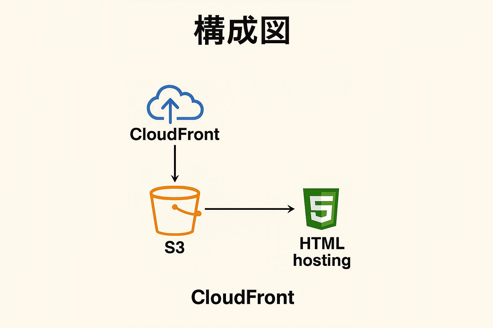

# terraform-fortune-site
Terraformで構築する占いサイト☆

# Fortune Site with Terraform

## 📌 概要
このプロジェクトは、Terraformを使ってAWS上に占いサイトを構築するものです。静的なHTMLをS3にホスティングし、CloudFrontで高速配信します。

## 🛠 使用技術
- Terraform
- AWS（S3, CloudFront）
- HTML/CSS/JavaScript
- Copilot ※本フォーマット作成補助

## 📁 ディレクトリ構成
```
terraform-fortune-site/
├── html/
│   └── index.html
├── main.tf
├── variables.tf
├── outputs.tf
└── images/
    └── architecture_fortune.png ※文字化け
```
## 🖼 構成図

この画像は、Terraformで構築される占いサイトのインフラ構成（CloudFront → S3 → HTMLホスティング）を視覚的に表現したものです。



## 🚀 デプロイ手順
1. AWS CLIの認証設定
2. "terraform init"
3. "terraform apply"

## 🔮 占い内容
- 今日の運勢
- ラッキーカラー
- おみくじ風メッセージ
- 落暉カラーに応じて背景のグラデーションが変化
- 背景に星が降るアニメーション

## 📄 ライセンス
このプロジェクトは MIT(Massachusetts Institute of Technology License) ライセンスのもとで公開されています。
著作権者：真也 (Shinya) & kotoha (Copilot name)
詳細は LICENSE ファイルをご確認ください
