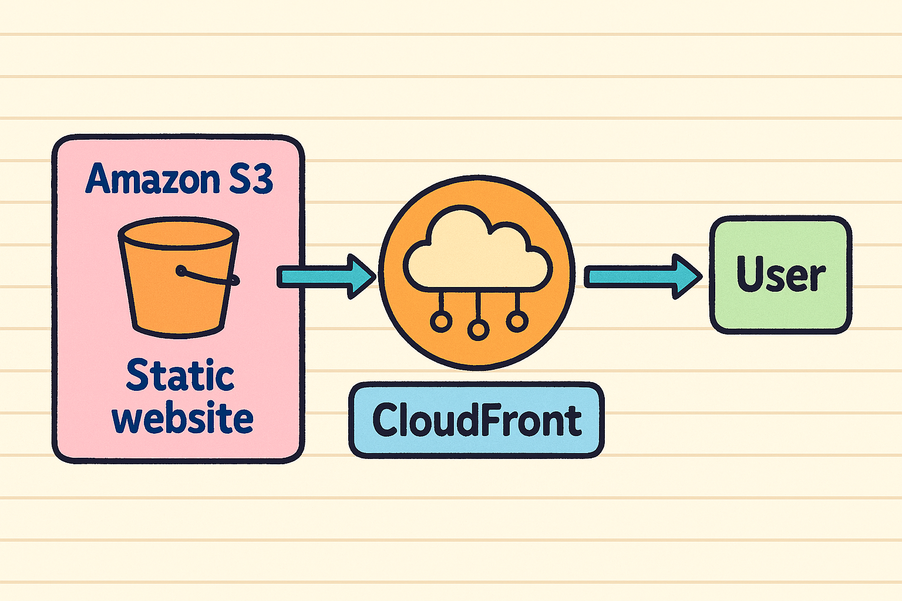

```# terraform-fortune-site
Terraformで構築する占いサイト☆

# Fortune Site with Terraform

## 📌 概要
このプロジェクトは、Terraformを使ってAWS上に占いサイトを構築するものです。静的なHTMLをS3にホスティングし、CloudFrontで高速配信します。

## 🛠 使用技術
- Terraform
- AWS（S3, CloudFront）
- HTML/CSS/JavaScript

## 📁 ディレクトリ構成

terraform-fortune-site/
├── html/
│   └── index.html
├── main.tf
├── variables.tf
├── outputs.tf
└── architecture.png

## 🖼 構成図


## 🚀 デプロイ手順
1. AWS CLIの認証設定
2. "terraform init"
3. "terraform apply"

## 🔮 占い内容
- 今日の運勢
- ラッキーカラー
- おみくじ風メッセージ

## 📄 ライセンス
MIT
